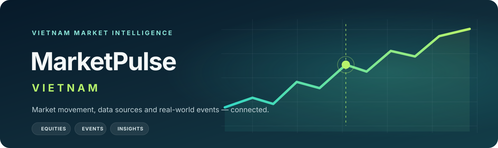

<p align="center">
  
</p>

<h1 align="center">MarketPulse VN</h1>

<p align="center"><strong>Event-driven market intelligence for Vietnam</strong></p>

**Project status: planning and repository foundation.** The application, live data integration and production deployment are not yet demonstrated in this repository. The roadmap describes a three-week, local-first portfolio demo; the broader product remains a longer-term plan.

MarketPulse VN is designed to bring Vietnamese equities, market indices, gold, foreign exchange, macro data, financial news and public events into one research experience. The central idea is to show market movement alongside relevant events while making data source and freshness visible. A nearby event is context, not proof of cause.

## Why this project

Market information is spread across data providers and publications. MarketPulse VN explores a traceable path from provider payloads through normalization and time-series storage to a clear dashboard. It combines a practical MERN application with a small Python collector and background processing where those tools fit.

The initial target is intentionally narrow: search a small set of Vietnamese stocks, inspect daily OHLCV history, view VN-Index and save a personal watchlist. The data target is 10–20 stocks plus VN-Index at end-of-day or delayed frequency, contingent on verified access, data rights and coverage. If those conditions are not met, the demo will use fixtures and be labeled as degraded.

## Project boundary

| Stage | Scope |
|---|---|
| Three-week local demo | Basic local authentication, stock search/detail/daily chart, VN-Index summary, single-user watchlist, deterministic fixtures or a verified bounded source, source/as-of/freshness labels. |
| Stretch after the core passes | A verified gold or USD/VND series, or a small manually sourced event timeline. One stretch at a time. |
| Later product phases | Full market dashboard, heatmap, broad news ingestion, AI classification, event impact, alerts, portfolio, correlation, comparisons, admin monitoring and production deployment. |

No live/intraday provider access is promised. This project does not provide investment advice, buy/sell recommendations, price predictions or real-money trading.

## Planned architecture

The diagram below is the intended design, not a claim that these services are running today.

~~~mermaid
flowchart LR
  Web["React + Vite<br/>Market views"] --> API["Express API<br/>Authentication and queries"]
  API --> Mongo["MongoDB<br/>Canonical records"]
  API --> Redis["Redis<br/>Cache and queue"]
  Collector["Python collector<br/>Provider adapter"] -->|authenticated ingestion| API
  Redis --> Worker["Node + BullMQ<br/>Normalization and jobs"]
  Worker --> Raw["Raw and normalized<br/>regular collections"]
  Worker --> TS["Time-series projection<br/>query workload"]
  Raw --> Mongo
  TS --> Mongo
  Events["Curated events<br/>later phase"] -.-> API
~~~

Ingestion keeps provider payloads separate from canonical data. Replay must be idempotent, and a time-series projection is treated as rebuildable because MongoDB time-series collections do not support unique indexes. Market values carry provider, currency/units, timezone, as-of time and freshness; missing observations are left missing. Event pages describe **associated market movement**, never causation.

## Repository guide

| Document | What it covers |
|---|---|
| [Product requirements](docs/PRD.md) | Vietnamese scope, all FR-01–FR-18 statuses, acceptance boundaries and explicit omissions. |
| [Market-data contract](docs/DATA_CONTRACT.md) | Versioned canonical schema, synthetic fixture semantics, units, provenance and offline checks. |
| [Three-week roadmap](docs/ROADMAP.md) | 21-day sequence, 15 implementation days, 6 review/buffer days, gates, fallback and risks. |
| [Provider research](docs/PROVIDER_RESEARCH.md) | MP-01 comparison, limited access probe, unresolved live-source gate and MP-02 fixture decision. |
| [Codex workflow](docs/CODEX_WORKFLOW.md) | Sequential planning, bounded implementation handoffs and independent review. |
| [CI/CD and documentation portal](docs/CI_CD.md) | Documentation checks, artifact build, Pages deployment and future application CI. |
| [GitHub setup](docs/GITHUB_SETUP.md) | Repository checks, Pages setup and branch-protection guidance. |
| [Original project brief](MarketPulse_VN_Project_Documentation.md) | Full Vietnamese source requirements, preserved as supplied. |

The brief is the product context; the PRD and roadmap define the smaller demo boundary. See [the GitHub repository](https://github.com/Son2110/Market-Pulse).

## Data research

- [Vnstock](https://vnstocks.com/docs/vnstock) provides a Python equity-data library. The library and underlying data rights are separate questions; availability and redistribution rights have not been tested for this project.
- [SSI FastConnect](https://developers.ssi.com.vn/docs/getting-started/overview) documents market APIs and streaming. Project credentials and coverage have not been tested.
- [GDELT DOC API](https://blog.gdeltproject.org/gdelt-doc-2-0-api-debuts/) is a candidate for later news research; the project does not promise a particular archive or Vietnam coverage.
- MongoDB’s [time-series limitations](https://www.mongodb.com/docs/manual/core/timeseries/timeseries-limitations/) inform the replay and uniqueness design.

The canonical market-data schema and synthetic-only fixture are described in the [data contract](docs/DATA_CONTRACT.md). Run its offline checks with the pinned development dependency:

```sh
python -m pip install -r requirements-dev.txt
python scripts/validate_market_data.py
python -m unittest discover -s tests -v
```

## Hosting direction

Development is local-first. Production is a later milestone with Vercel for the frontend, Render for API/background worker and scheduled collector services, and MongoDB Atlas for storage. A Redis-compatible queue service, network access, service limits, backup/restore and cost still require validation before provisioning. GitHub Pages is reserved for the documentation portal and is separate from the application frontend.

## Responsible use

MarketPulse VN is a portfolio and research project. It is not an investment adviser or broker. Data may be delayed, incomplete or subject to provider terms. Every future market view should show its source and as-of time; a visual relationship between an event and a price change does not establish causation.

No open-source license has been selected yet.
